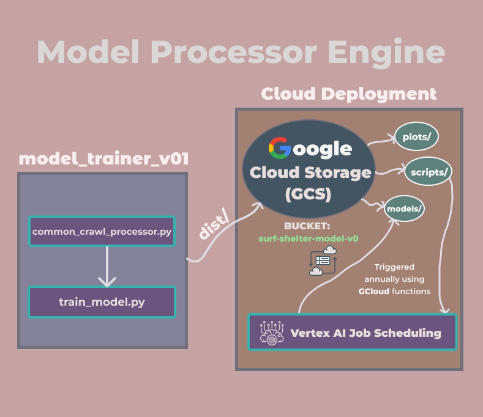

# Surf Shelter Model Processor Engine

The Surf Shelter Model Processor Engine is an autonomous system for training supervised machine learning models to detect malicious URLs.

## Overview

The Model Processor currently leverages **2000 URLs** from the [Amazon Common Crawl](https://commoncrawl.org/) Dataset's first WARC path and utilizes eight numerical features from the Features Processor Engine to build and train an SVM classifier.

The engine is designed to integrate with large-scale web data pipelines, including but not limited to metadata and scripts of websites, far surpassing Common Crawl's billions of URLs. By leveraging big data, it aims to build an intelligent filtration system for identifying click fraud, pay fraud, and other malicious activities on the internet through the analysis of web patterns and metadata.

## Features

### Modular Training Workflow
- **Data Extraction**: Extracts 2000 URLs from the first WARC path of Amazon’s Common Crawl Dataset using the `common_crawl_processor` module.
- **Feature Extraction**: Calls the Features Processor Engine to extract eight features and corresponding labels using the `train_model` module.
- **Model Training**: Trains an SVM model with a linear kernel using the `sklearn.svm` library for binary classification.

### Cloud Integration
- **Google Cloud Deployment**: Stores the latest model in a structured Google Cloud Storage bucket (`models/`, `plots/`, `scripts/`).
- **Automated Periodic Training**: Leverages Vertex AI with a Google Cloud Function to retrain the model annually using updated datasets.

### Distributable Package
- Developed a reusable Python package (`model_trainer_v0`) for training, enabling scalability and repeatability.

### Source Code
- [`common_crawl_processor`](https://github.com/KarkiAdit/surf-shelter-model-processor-engine/blob/master/surf_shelter_training_pkg_v0/model_trainer_v0/common_crawl_processor.py): Handles data extraction.
- [`train_model`](https://github.com/KarkiAdit/surf-shelter-model-processor-engine/blob/master/surf_shelter_training_pkg_v0/model_trainer_v0/train_model.py): Handles feature extraction and model training.

## High-Level Design

The Model Processor Engine comprises two primary components:

1. **Model Trainer Package (`model_trainer_v01`)**
   - Modular structure with two scripts:
     - `common_crawl_processor.py`: Handles data extraction from Common Crawl.
     - `train_model.py`: Manages feature extraction and SVM model training.

2. **Cloud Deployment**
   - Google Cloud Storage bucket (`surf-shelter-model-v0`) for storing models, plots, and scripts.
   - Automated model retraining integrated with Vertex AI Job Scheduling, triggered by GCloud functions for periodic updates.

The following diagram illustrates the architecture:



## Developer Setup

### 1. Install Dependencies
Install the Google Cloud SDK and authenticate:

```bash
gcloud auth login
gcloud config set project [YOUR_PROJECT_ID]
```

### 2. Create Google Cloud Resources
Create a Google Cloud Storage bucket:

```bash
gcloud storage buckets create gs://[YOUR_BUCKET_NAME] --location=[YOUR_REGION]
```

### 3. Build and Upload Training Module
1. Build the distributable package:
```bash
python setup.py sdist bdist_wheel
```
2. Upload the package to the scripts/ directory in the GCS bucket:
```bash
gcloud storage cp dist/[YOUR_PACKAGE_NAME].tar.gz gs://[YOUR_BUCKET_NAME]/scripts/
```

### 4. Set Up Vertex AI Job Scheduling
Create a Vertex AI custom training job:

```bash
gcloud ai custom-jobs create \
  --display-name="[YOUR_JOB_NAME]" \
  --python-package-uris=gs://[YOUR_BUCKET_NAME]/scripts/[YOUR_PACKAGE_NAME].tar.gz \
  --python-module=[YOUR_TRAINING_MODULE] \
  --region=[YOUR_REGION] \
  --worker-pool-spec='machine-type=[YOUR_MACHINE_TYPE],replica-count=1'
```

### 5. Trigger Training Job Using Cloud Functions
Deploy a Cloud Function to trigger periodic model training:

```bash
gcloud functions deploy [YOUR_FUNCTION_NAME] \
  --runtime=python39 \
  --trigger-http \
  --allow-unauthenticated \
  --set-env-vars MODEL_PROCESSOR_ID=[YOUR_PROJECT_ID],FEATURE_PROCESSOR_SERVICE_URL=[YOUR_SERVICE_URL]
```

## Technologies Used

- Python
- scikit-learn
- Google Cloud SDK
- Google Cloud Storage (GCS)
- Vertex AI
- Google Cloud Functions
- Google Cloud Scheduler
- Common Crawl Dataset
- setuptools

## Acknowledgments

[Google Cloud CLI Documentation](https://cloud.google.com/sdk/docs). 
[Vertex AI Documentation](https://cloud.google.com/vertex-ai/docs). 
[scikit-learn Documentation](https://scikit-learn.org/stable/). 
